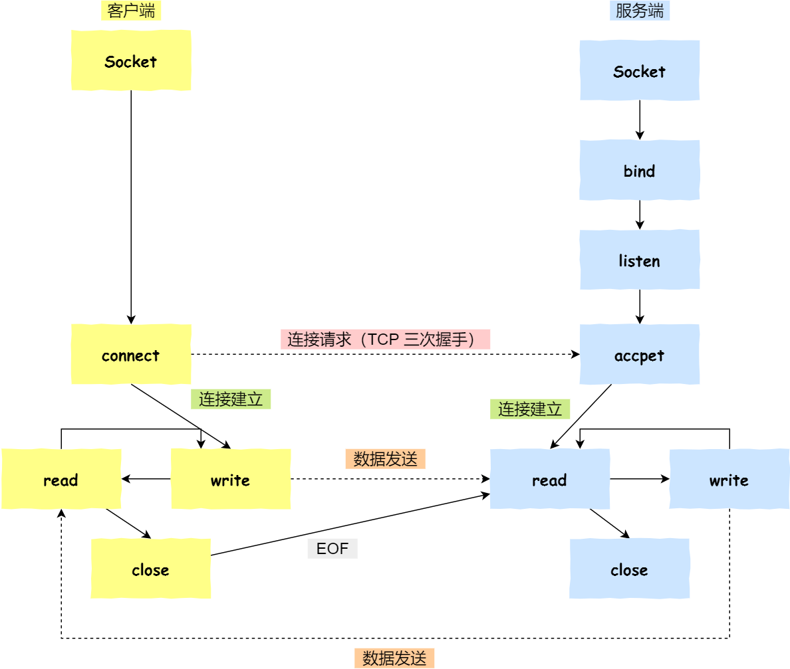

注：本课程使用的API依赖于Linux系统，对于其他平台不具备可移植性

- 程序：源代码或指令，是静态的概念(安装包)
- 进程：正在执行的程序的实例，是动态的概念；一个程序可以创建多个进程，多个进程可以调用同一个程序；进程结束时，系统会回收进程的内核资源
- 线程：由进程所引发的执行流，从属于进程，一个进程可以有多个线程；线程之间共享进程的资源，但是线程之间的执行是并发的，进程之间的执行是串行的
- 任务：具体要做的事情

pid = process id 进程id

任务间通讯与同步方式共七种：
    1) 通讯(数据传输)：管道(有名/无名) socket套接字 消息队列 共享内存
    2) 同步(资源互斥)：信号量 互斥锁 信号

### 无名管道
- 数据传输是单向的，只适用于有血缘关系/公共祖先的进程间通信，因此不能用于网络通信
- 常用函数：创建无名管道pipe()、改变管道权限close()、读管道read()、写管道write()

### 有名管道
- 适用于没有任何血缘关系的进程间通信
- 常用函数：创建有名管道mkfifo()、打开管道open()、读管道read()、写管道write()

### 共享内存
- 多个进程共享一段内存，进程间通讯最快的方式，但是没有同步机制，需要自己实现
- 把这段内存空间映射到多个进程(有无血缘关系均可)，某一进程对这段内存的操作都会影响到其他进程
- 常用函数：创建共享内存shmget()、建立映射关系shmat()、解除映射关系shmdt()、删除共享内存shmctl()

### 消息队列
- 是一种以结构体为载体的数据容器，应用于进程间通信时有无血缘关系均可
- 消息队列是一个消息链表，存放在内核中，进程间通讯的方式，可以实现进程间(有无血缘关系均可)的同步
- 常用函数：创建消息队列msgget()、发送消息msgsnd()、接收消息msgrcv()、删除消息队列msgctl()

### 信号量
- 是一个由内核维护的>=0的整数，用来表示某种资源的数量，具有排他性，可以用来实现进程间的同步

### 无名信号量
- 是一个计数器，用来控制多个进程或同一进程内线程间对共享资源的访问
- 信号量是一个整数，用来表示某种资源的数量，可以用来实现进程间的同步
- 常用函数：创建信号量sem_init()、消耗资源计数sem_wait()、增加资源计数sem_post()、删除信号量sem_destory()
                
### 有名信号量
- 用于没有血缘关系的进程间通信
- 常用函数：初始化并打开有名信号量sem_open()、关闭有名信号量sem_close()、删除有名信号量sem_unlink()

### 互斥锁
- 可以理解为只能加锁或解锁的信号量，更多的用在线程之间的同步，而不是进程之间的同步
- 互斥锁是一个结构体，用来实现进程间的同步
- 常用函数：初始化互斥锁pthread_mutex_init()、加锁pthread_mutex_lock()、解锁pthread_mutex_unlock()、销毁pthread_mutex_destory()

### 信号
- 内核与应用进程之间或应用程序与应用程序之间传递控制命令的方法，而不是传递数据
- 信号是一种异步通知机制，可以用来实现进程间的同步
- 常用函数：发送信号、捕捉信号、忽略信号

### 七层OSI计算机网络层次模型：
- 应用层：文件传输、电子邮件、虚拟终端，为应用程序提供服务，如HTTP、FTP、SMTP、DNS
- 表示层：数据格式化、代码转化、数据加密，数据的表示、安全、压缩，如JPEG、MPEG
- 会话层：解除或建立与别的结点的联系，建立、管理、终止会话，如RPC、SQL
- 传输层：提供端对端的通信接口，定义传输数据的协议端口号，以及流控和差错校验，如TCP、UDP
- 网络层：为数据包选择路由，进行逻辑地址寻址，实现不同网络之间的路径选择，如IP、ICMP
- 数据链路层：传输有地址的帧以及错误检测功能，建立逻辑连接、进行硬件地址寻址、差错校验，如以太网、PPP
- 物理层：以二进制数据形式在物理媒体上传输数据，建立、维护、断开物理连接，确定电平传输方式，如网线、光纤

### TCP与UDP的区别
- TCP：面向连接的，三握四挥，可靠传输，效率低，适用于传输少量数据
- UDP：面向无连接的，不可靠传输，效率高，适用于传输大量数据
- 专注于系统下API的使用即可，不必关心底层实现

### TCP协议
- 服务器端：socket() -> bind() -> listen() -> accept() -> recv()/read() -> send()/write() -> close()
- 客户端：socket() -> connect() -> send()/write() -> recv()/read() -> close()

### UDP协议
- 服务器端：socket() -> bind() -> recvfrom() -> sendto() -> close()
- 客户端：socket() -> sendto() -> recvfrom() -> close()

- UDP是面向无连接的，因此与TCP相比不存在accept()、connect()、listen()等函数

### 循环/迭代服务器
- 一个客户端连接服务器，服务器处理完当前客户端的请求后，再处理下一个客户端的请求

### 并发服务器
- 多个客户端同时连接服务器，服务器可以同时处理多个客户端的请求
- 将多进程、多线程的知识用到服务器/客户端程序中，可以实现并发服务器